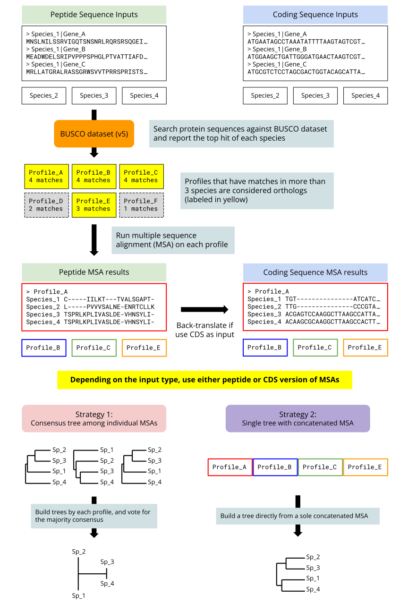

[](https://github.com/stajichlab/PHYling/actions/workflows/conda-build.yml)
[](https://github.com/stajichlab/PHYling/actions/workflows/python-versions.yml)
[](https://github.com/stajichlab/PHYling/actions/workflows/python-versions.yml)
[](https://github.com/stajichlab/PHYling/blob/main/LICENSE)

# PHYling tool

The unified PHYling pipeline for phylogenomic data collection from annotated genomes.

This is latest iteration of tool for using phylogenetically conserved markers to pull out informative
gene or protein info from genomic and transcriptomic datasets in order to construct gene trees and species phylogenies.

The aligned markers can be extracted from protein sequences for phylogenetic analyses and also projected into coding sequence alignments for codon-based analyses for better resolution of recently diverged species.

The assumptions in this approach are that the markers are generally single copy in genomes and taking best hit is sufficient first approximation for identifying orthologs. A separate file is parsed and file best_multihits which lists all the hits above the cutoff threshold for a given marker which can be used to assess duplication or attempt to incorporate paralogs into the analysis down the road.

The marker sets developed for this approach in fungi are available as part of the [1KFG Phylogenomics_HMMs](https://github.com/1KFG/Phylogenomics_HMMs) project resource and preferred use of the [BUSCO marker sets][Busco].

### Flow chart



### New features compared to the original version

- Using [pyhmmer] to improve the multithread performance in hmmsearch and hmmalign.
- Implement all stuff in python. The entire program will be more readable and maintainable.
- Simplify some steps and reduce the intermediate files as much as possible.
- [Muscle] is now available for alternative alignment method.
- Use [PhyKIT] to remove uninformative orthologs.
- [FastTree] is now available for tree construction.
- [ASTER], a C++ version of [ASTRAL] is now integrated to resolve consensus among trees built upon individual genes.

## Usage

First of all, install the package following the [instruction](#requirements-and-installation) below.

PHYling is a package to extract phylogenomic markers and build a phylogenetic
tree upon them. It comprises 3 modules - download, align and tree. Use `phyling --help` to see more details.

```
positional arguments:
  {download,align,tree}
    download            Download HMM markers
    align               Run multiple sequence alignments against orthologs found among samples
    tree                Build a phylogenetic tree based on multiple sequence alignment results

options:
  -h, --help            show this help message and exit
  -V, --version         show program's version number and exit
```

To test run on the example files, please `cd` into the folder `example`.

```
cd example
```

In general, PHYling takes fasta as input. The gzipped fasta is also valid.

The folder `example/pep` includes 5 example peptide fasta which can be used for test run.

In addition to the peptide sequences, PHYling can also takes DNA coding sequences as inputs to more accurately estimate the phylogeny of closely related species.
When taking DNA coding sequences as inputs, DNA sequences will be translated into peptide sequences and all the hmmsearch/align are done on the peptide version.
The final MSA results will be back-translated into DNA at the final stage.
The example DNA sequences are placed under the folder `example/cds`.

### Download HMM markerset

The download module is used to download the HMM markerset from BUSCO website. (Currently is updated to [v5][Busco])
See all options with `phyling download --help`.

```
positional arguments:
  HMM markerset or "list"
                        Name of the HMM markerset

options:
  -h, --help            show this help message and exit
  -v, --verbose         Verbose mode for debug
```

Firstly, use `download list` to show the available BUSCO markersets.

```
phyling download list
```

By default the downloaded markersets will be saved to the `~/.phyling/HMM`.
The `Downloaded datasets` section listed the markersets that have already been downloaded.

To download the markerset, copy the name from the list and paste it to the download module directly.
Here we use `fungi_odb10` as example.

```
phyling download fungi_odb10
```

### Find the orthologs and align them

The align module identify the orthologs among all the samples using _hmmsearch_.
HMM profiles that have matches on more than 3 samples are considered **orthologs**.

Before conducting _hmmsearch_, the module will first search for the bitscore cutoff file within the root HMM folder.
If the cutoff file is not found, the reporting threshold for _hmmsearch_ will be determined based on the `-E/-evalue` (default is 1e-10).

Once the orthologs are identified, the sequences extracted from each sample undergo multiple sequence alignment.
By default, the alignment is performed using the _hmmalign_ method.
However, users have the option to switch to using _muscle_ by specifying the `-M/--method muscle` flag.

Finally, each alignment result is output separately.
You can decide whether you want to concatenate them in the tree module.
See all the options with `phyling align --help`.

```
options:
  -h, --help            show this help message and exit
  -v, --verbose         Verbose mode for debug
  -i file [files ...], --inputs file [files ...]
                        Query pepetide/cds fasta or gzipped fasta
  -I directory, --input_dir directory
                        Directory containing query pepetide/cds fasta or gzipped fasta
  -o directory, --output directory
                        Output directory of the alignment results (default: phyling-align-20240227-103913-0800
                        [current timestamp])
  -m directory, --markerset directory
                        Directory of the HMM markerset
  -E float, --evalue float
                        Hmmsearch reporting threshold (default: 1e-10)
  -M {hmmalign,muscle}, --method {hmmalign,muscle}
                        Program used for multiple sequence alignment (default: hmmalign)
  --non_trim            Report non-trimmed alignment results
  --from_checkpoint     Load previous hmmsearch results from .checkpoint.pkl in the output directory
  -t THREADS, --threads THREADS
                        Threads for hmmsearch and the number of parallelized jobs in MSA step. Better be multiple of 4
                        if using more than 8 threads (default: 1)
```

Run the align module with all the fasta files under folder `pep`.

```
phyling align -I pep -o align -m HMM/fungi_odb10/hmms
```

An equivalent way to send inputs.

```
phyling align -i pep/*.fasta.gz -o align -m HMM/fungi_odb10/hmms
```

Or if you're just interested in part of the fasta, you can specify the inputs one-by-one.

```
phyling align -i pep/Pilobolus_umbonatus_NRRL_6349.aa.fasta.gz \
  pep/Rhizopus_homothallicus_CBS_336.62.aa.fasta.gz \
  pep/Rhizopus_rhizopodiformis_NRRL_2570.aa.fasta.gz \
  -o align \
  -m HMM/fungi_odb10/hmms
```

**Note: Required at least 3 samples in order to build a tree!**

Accelerate by using 16 cpus.

```
phyling align -I pep -o align -m HMM/fungi_odb10/hmms -t 16
```

#### Multithreading strategy

According to [pyhmmer benchmark](https://pyhmmer.readthedocs.io/en/stable/benchmarks.html), the acceleration benefits from multithreading drop significantly as more CPUs are utilized.
When less then 8 cpus are given, the hmmsearch step will run in single-thread manner and all cpus will be used for each round of hmmsearch.
When 8 or more cpus are given, the hmmsearch step will use 4 cpus for each parallel job.
In the example above, 4 hmmsearch jobs will run parallelly and each job utilize 4 cpus.
For the alignment step, 16 parallel jobs will be launched and each parallel job is running in single-thread manner.

Highly recommended if **muscle** is chosen for alignment. (**muscle** is much slower than **hmmalign**!!)

#### Checkpoint for quick rerun

A checkpoint file will be generated after the hmmsearch step.
The `--from_checkpoint` option allow you to retrieve already completed hmmsearch results on those inputs that don't have changes to save time.
Only the newly added/changed inputs will do the hmmsearch when `--from_checkpoint` is enabled.
Meanwhile, the samples not specified in the command with `--from_checkpoint` will be removed from the checkpoint file.

#### Use coding sequences instead of peptide sequences

In some circumstances, the highly shared peptide sequences make it difficult to resolve the relationship among closely related species.
To address the issue, one can use DNA coding sequences (CDS), which contain more evolutionary traces, instead of peptide sequences for phylogeny analysis.

Run the align module with cds fasta files under folder `cds`.

```
phyling align -I cds -o align_cds -m HMM/fungi_odb10/hmms -t 16
```

The CDS inputs will be translated into peptide sequences in the first steps.
The translated peptide sequences will be used for hmmsearch and the alignment steps.
The peptide alignment results will then being back-translated according to the original CDS inputs.
And the back-translated DNA version alignments will be output.

### Build tree from multiple sequence alignment results

Finally, we can run the tree module to use the multiple sequence alignment results to build a phylogenetic tree.
By default, it uses the _consensus tree_ strategy (conclude the majority of trees which was built upon each single gene)
But you can choose to use _concatenated alignment_ strategy by specifying `-c/--concat`.
Currently, 3 methods (upgma, Neighbor Joining and FastTree) are available for tree building.
We further calculate the [treeness/RCV] by [PhyKit] and select the top 50 most informative markers for final tree building.
See all the options with `phyling tree --help`.

```
options:
  -h, --help            show this help message and exit
  -v, --verbose         Verbose mode for debug
  -i file [files ...], --inputs file [files ...]
                        Multiple sequence alignment fasta of the markers
  -I directory, --input_dir directory
                        Directory containing multiple sequence alignment fasta of the markers
  -o directory, --output directory
                        Output directory of the newick treefile (default: phyling-tree-20240227-103934-0800 [current
                        timestamp])
  -M {upgma,nj,ft}, --method {upgma,nj,ft}
                        Algorithm used for tree building. (default: upgma)
                        Available options:
                        UPGMA: upgma
                        Neighbor Joining: nj
                        FastTree: ft
  -n TOP_N_TOVERR, --top_n_toverr TOP_N_TOVERR
                        Select the top n markers based on their treeness/RCV for final tree building (default: 50.
                        Specify 0 to use all markers)
  -c, --concat          Concatenated alignment results
  -f, --figure          Generate a matplotlib tree figure
  -t THREADS, --threads THREADS
                        Threads for tree construction (default: 1)
```

Run the tree module with all the alignment results under folder `align`.

```
phyling tree -I align
```

You can also use only part of the alignment results to build tree.

```
phyling tree -i align/100957at4751.aa.mfa align/174653at4751.aa.mfa align/255412at4751.aa.mfa
```

**Note: the checkpoint file .checkpoint.pkl is required in the same directory to provide the sample names and sequence type for tree building.**

Use FastTree instead of the default UPGMA method for tree building and running with 16 threads.

```
phyling tree -I align -m ft -t 16
```

Use matplotlib to generate a tree figure.

```
phyling tree -I align -f
```

#### Use concatenate strategy

By default the consensus strategy is used but users can choose to concatenate the markers and generate a single tree on it.

```
phyling tree -I align -c
```

When enable the concatenate option, the concatenated fasta will be output to the designated output folder.
Meanwhile, a partition file compatible with RAxML and IQTree will also being generated to support users who are interested in using RAxML and IQTree.

**Note: with default setting PHYling will only concatenate top 50 markers based on their treeness/RCV score.
See more [details](#use-top_n_toverr-to-filter-the-markers-by-treenessrcv) in the section below.**

#### Use top_n_toverr to filter the markers by treeness/RCV

The align module usually report a lot of markers.
We integrate [PhyKIT] to calculate the [treeness/RCV] value to determine how informative a marker is.
The higher the [treeness/RCV] values, the marker are more informative and least susceptible to composition bias.
By doing so, we're able to select the most informative and rubost markers to build the final tree.

By default the top 50 markers are selected for the final tree building.
You can specify your own desired number.
Say we want only the top 20:

```
phyling tree -I align -n 20 -t 16
```

You can also enable the -c/--concat at the same time to concatenate only the top ranked markers.
The following example will concatenate the top 20 markers.
```
phyling tree -I align -c -n 20 -t 16
```

If you want to use all the markers without filtering, you can specify `-n/--top_n_toverr 0`.

```
phyling tree -I align -n 0 -t 16
```

**Note: when -n/--top_n_toverr is enable (>0), a file `top_toverr_trees.tsv` that record the treeness/RCV of selected markers will be generate as well.**

## Requirements

- Python >= 3.9
- [Biopython](https://biopython.org/)
- [pyhmmer], a HMMER3 implementation on python3.
- [muscle] for alternative method for multiple sequence alignment. (Optional)
- [ClipKIT] for removing sites that are poor of phylogenetic signal.
- [PhyKIT] for calculating treeness/RCV to filter uninformative orthologs.
- [FastTree], use approximately maximum-likelihood to build trees. (Optional)
- [ASTER], a C++ re-implementation of [ASTRAL] to resolve consensus among trees.

## Install

Please download the source code from the [latest release](https://github.com/stajichlab/PHYling/releases/latest) and decompress it or `git clone` the main branch.

Go into the PHYling folder.
To avoid messing around the base environment, consider installing it in a conda environment.
Please use the environment.yml to create environment and install all the required packages.

```
cd PHYling-2.0.0-beta
conda env create -f environment.yml
```

Install the package through pip in the PHYling folder.

```
pip install .
```

### Install additional package for developing (developer only)

Developer should clone the GitHub project directly instead of downloading from the releases.
Some of the files for developing purpose only are not included in the releases.

In addition to the requirements listed above, the following packages are required for developing environment.

- [pre-commit] >= 3.4.0

Developer can install it with conda by:

```
conda install pre-commit>=3.4.0
```

For convenience we also provide the additional conda env file. Please use the dev_additional_packages.yml to install the additional packages.

```
conda env update -f dev_additional_packages.yml
```

## Notes

- Training your own marker set is also possible but most busco sets are good starting place.
- The multiple sequence alignment results can also be sent to other phylogenetic tool like IQ-tree for tree building.

[Busco]: https://busco-data.ezlab.org/v5/data/lineages/
[pyhmmer]: https://pyhmmer.readthedocs.io/en/stable/index.html
[muscle]: https://drive5.com/muscle5/
[ClipKIT]: https://jlsteenwyk.com/ClipKIT/
[PhyKIT]: https://jlsteenwyk.com/PhyKIT/
[Treeness/RCV]: https://jlsteenwyk.com/PhyKIT/usage/index.html#treeness-over-rcv
[FastTree]: http://www.microbesonline.org/fasttree/
[ASTER]: https://github.com/chaoszhang/ASTER
[ASTRAL]: https://github.com/smirarab/ASTRAL
[pre-commit]: https://pre-commit.com/
