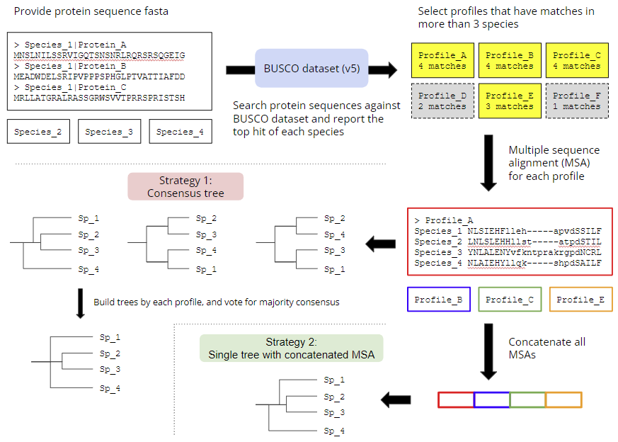

# PHYling tool
The unified PHYling pipeline for phylogenomic data collection from annotated genomes.

This is latest iteration of tool for using phylogenetically conserved markers to pull out informative 
gene or protein info from genomic and transcriptomic datasets in order to construct gene trees and species phylogenies.

The aligned markers can be extracted from protein sequences for phylogenetic analyses and also projected into coding sequence alignments for codon-based analyses for better resolution of recently diverged species.

The assumptions in this approach are that the markers are generally single copy in genomes and taking best hit is sufficient first approximation for identifying orthologs. A separate file is parsed and file best_multihits which lists all the hits above the cutoff threshold for a given marker which can be used to assess duplication or attempt to incorporate paralogs into the analysis down the road.

The marker sets developed for this approach in fungi are available as part of the [1KFG Phylogenomics_HMMs](https://github.com/1KFG/Phylogenomics_HMMs) project resource and preferred use of the [BUSCO marker sets](https://busco-data.ezlab.org/v5/data/lineages/).

### Flow chart


### New features compared to the original version
- Using pyhmmer to improve the multithread performance in hmmsearch and hmmalign.
- Implement all stuff in python. The entire program will be more readable and maintainable.
- Simplify some steps and reduce the intermediate files as much as possible.
- Muscle is now available for alternative alignment method.

## Usage
PHYling is a package to extract phylogenomic markers and build a phylogenetic
tree upon them. It comprises 3 modules - download, align and tree. Use `python3 phyling.py --help` to see more details.
```
positional arguments:
  {download,align,tree}
    download            Download HMM markers
    align               Run multiple sequence alignments against orthologs
                        found among samples
    tree                Build a phylogenetic tree based on multiple sequence
                        alignment results

optional arguments:
  -h, --help            show this help message and exit
  -V, --version         show program's version number and exit
```

To test run on the example files, please `cd` into the folder `test`.
```
cd test
```
The folder `test/pep` includes 4 example peptide fasta - **Afum.aa.fasta**, **Rant.aa.fasta**, **Scer.aa.fasta** and **Zymps1.aa.fasta**.

### Download HMM markerset
The download module is used to download the HMM markerset from BUSCO website. (Currently is updated to v5) 
See all options with `phyling.py download --help`.
```
positional arguments:
  HMM markerset or "list"
                        Name of the HMM markerset

optional arguments:
  -h, --help            show this help message and exit
  -v, --verbose         Verbose mode for debug
  -o OUTPUT, --output OUTPUT
                        Output directory to save HMM markerset
                        (default="./HMM")
```

Firstly, use `download list` to show the available BUSCO markersets.
```
python3 ../phyling.py download list
```

Copy and paste the markerset to download it. Here we use `fungi_odb10` as example.
```
python3 ../phyling.py download fungi_odb10
```

### Find the orthologs and align them
Next use the align module to get orthologs among all the samples by hmmsearch. 
HMM profiles having matches on more than 3 samples are considered **orthologs**.
For each ortholog, the seqeunces extracted from each sample are underwent multiple sequence alignment.
By default the alignment is done by **hmmalign**. You can switch to **muscle** by specifying `-M/--method muscle`.

By default, each alignment result is output separately and is expected to resolve their phylogeny by consensus tree method.
If you prefer to use concatenate strategy. You can concatenate all the alignment by passing `-c/--concat`. 
See all the options with `phyling.py align --help`.
```
options:
  -h, --help            show this help message and exit
  -v, --verbose         Verbose mode for debug
  -i INPUTS [INPUTS ...], --inputs INPUTS [INPUTS ...]
                        Query pepetide fasta
  -I INPUT_DIR, --input_dir INPUT_DIR
                        Directory containing query pepetide fasta
  -o OUTPUT, --output OUTPUT
                        Output diretory of the alignment results (default="./align")
  -m MARKERSET, --markerset MARKERSET
                        Directory of the HMM markerset
  -E EVALUE, --evalue EVALUE
                        Hmmsearch reporting threshold (default=1e-10)
  -M {hmmalign,muscle}, --method {hmmalign,muscle}
                        Program used for multiple sequence alignment (default="hmmalign")
  -n, --non_trim        Report non-clipkit-trimmed alignment results
  -c, --concat          Report concatenated alignment results
  -t THREADS, --threads THREADS
                        Threads for hmmsearch and the number of parallelized jobs in MSA step (default=1)
```

Run the align module with all the fasta files under folder `pep`.
```
python3 ../phyling.py align -I pep -m HMM/fungi_odb10/hmms
```

An equivalent way to send inputs.
```
python3 ../phyling.py align -i pep/*.fasta -m HMM/fungi_odb10/hmms
```

Or if you're just interested in part of the fasta, you can specify the inputs one-by-one.
```
python3 ../phyling.py align -i pep/Afum.aa.fasta pep/Rant.aa.fasta pep/Scer.aa.fasta -m HMM/fungi_odb10/hmms
```
**Note: Required at least 3 samples in order to build a tree!**

Accelerate by using 10 threads. 
The hmmsearch step is not parallized so 10 threads will be used to process sample in each loop.
For the alignment step, 10 parallel jobs will be launched with single-thread for each job.
Highly recommended if **muscle** is chosen for alignment. (**muscle** is much slower than **hmmalign**)
```
python3 ../phyling.py align -I pep -m HMM/fungi_odb10/hmms -t 10
```

### Build tree on multiple sequence alignment results
Finally, we can run the tree module to use the multiple sequence alignment results to build a phylogenetic tree. 
It support both *consensus tree* (conclude the majority of trees which was built upon each single gene) and *concatenated alignment* method. 
See all the options with `phyling.py tree --help`.
```
optional arguments:
  -h, --help            show this help message and exit
  -v, --verbose         Verbose mode for debug
  -i INPUTS [INPUTS ...], --inputs INPUTS [INPUTS ...]
                        Multiple sequence alignment fasta
  -I INPUT_DIR, --input_dir INPUT_DIR
                        Directory containing multiple sequence alignment fasta
  -o OUTPUT, --output OUTPUT
                        Output diretory of the newick treefile (default=".")
  -m {upgma,nj}, --method {upgma,nj}
                        Algorithm used for tree building (default="upgma")
  -f, --figure          Generate a matplotlib tree figure
```

Run the tree module with all the alignment results under folder `align`.
```
python3 ../phyling.py tree -I align
```

You can also use only part of the alignment results to build tree.
```
python3 ../phyling.py tree -i align/100957at4751.faa align/174653at4751.faa align/255412at4751.faa
```

Use Neighbor Joining algorithm instead of the default UPGMA method for tree building.
```
python3 ../phyling.py tree -I align -m nj
```

Use matplotlib to generate a tree figure.
```
python3 ../phyling.py tree -I align -f
```

## Requirements
- Python >= 3.7
- [Biopython](https://biopython.org/)
- [pyhmmer](https://pyhmmer.readthedocs.io/en/stable/index.html), a HMMER3 implementation on python3.
- [muscle](https://drive5.com/muscle5/) for alternative method for multiple sequence alignment.
- [clipkit](https://jlsteenwyk.com/ClipKIT/) for trimming.

Use the env.yaml to install all the required packages
```
conda env create -f env.yaml
```

## Notes
- Training your own marker set is also possible but most busco sets are good starting place.
- The multiple sequence alignment results can also be sent to other phylogenetic tool like IQ-tree for tree building.
